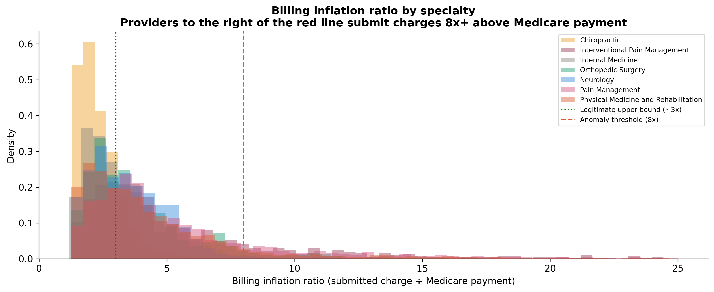
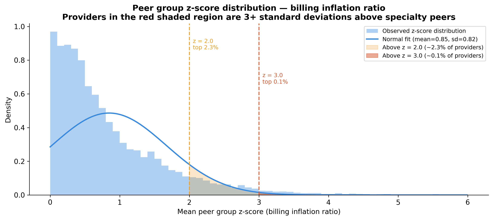
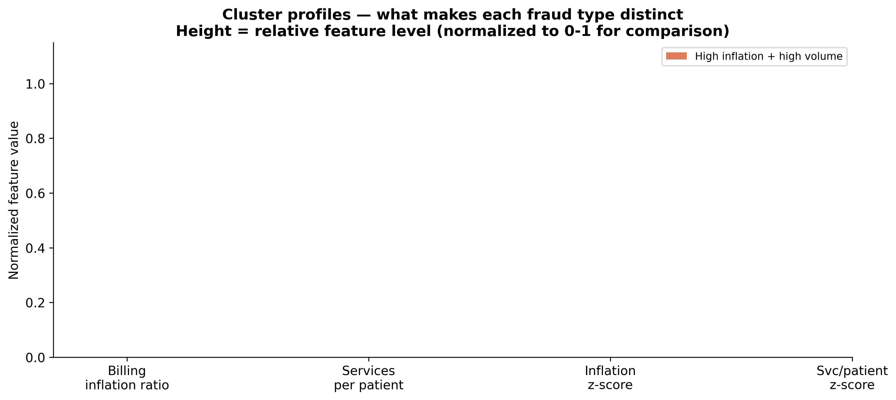
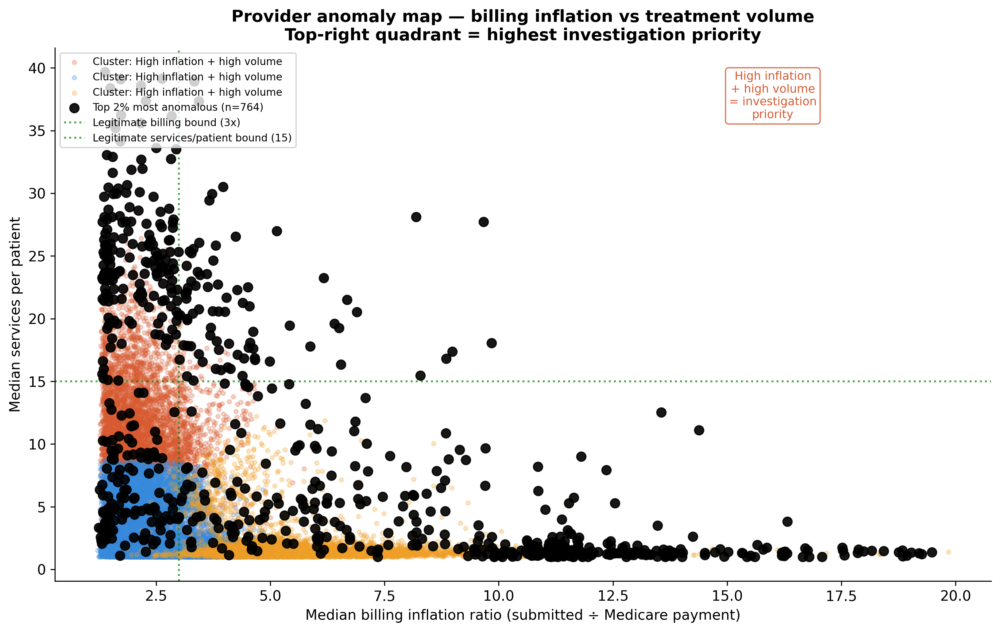

# Medicare Provider Billing Anomalies in No-Fault PIP States

**Unsupervised anomaly detection on 38,816 Medicare providers across seven no-fault insurance states**

---

## What This Project Is About

Every time you get into a car accident in New York, New Jersey, Florida, or a handful of other states, your own insurance company pays your medical bills, no matter who caused the crash. That is what no-fault insurance means. You do not have to sue anyone. You just file a claim and your insurer pays the doctors directly. This is called Personal Injury Protection, or PIP.

The problem is that some medical providers figured out they can exploit this system. They bill your insurer for treatments that never happened, inflate the cost of treatments that did happen, or keep patients coming back for medically unnecessary visits because every visit is another bill. This is called a PIP mill. A clinic organized around maximizing insurance payments rather than treating patients.

The question this project asks is: can we find these providers using only publicly available billing data, without anyone telling us in advance which ones are fraudulent?

---

## The Data and Why It Works

The Centers for Medicare and Medicaid Services (CMS) publishes every year exactly how much each doctor and clinic in America billed Medicare and how much Medicare actually paid. The entire file (Medicare Part B data) is free, publicly available, and covers over nine million provider-procedure combinations nationally. No registration is required to download it.

A nine million row dataset was filtered down to 85,862 rows covering 38,816 unique providers across seven no-fault states: New York, New Jersey, Michigan, Florida, Massachusetts, Pennsylvania, and Hawaii and seven soft-tissue injury specialties including Physical Medicine and Rehabilitation, Chiropractic, Neurology, Orthopedic Surgery, Internal Medicine, and Pain Management.

This filtering happens using DuckDB, a tool that runs standard SQL queries directly on the raw 3.5 GB CSV file without loading it into memory. The same SQL language used in claims systems. The 9.7 million row file never enters RAM, only the filtered results do. This is why the project does not crash on a laptop.

**Why these seven states:** The analysis was limited to these 7 U.S. states, which have no-fault PIP laws and enough providers in the relevant specialties to draw statistically sound comparisons. 

**Why Medicare data for a PIP problem:** PIP and Medicare draw from largely the same pool of providers billing for soft-tissue injuries, using the same procedure codes and billing patterns, both visible in Medicare Part B data. What makes Medicare especially valuable here is its fixed reimbursement rates, which are similarly fixed under no-fault PIP.

**Hawaii note:** Hawaii providers are retained but excluded from modeling. With only 958 rows across all specialties, peer groups are too small to produce reliable z-scores. All Hawaii results are flagged as low-confidence.

---

## The Three Features

### Step 1 — Feature Engineering

Everything in the model is built from three numbers engineered from the raw CMS billing columns. Each one captures a different dimension of suspicious behavior. None of them require a fraud label to compute becasue they come directly from the billing data itself.

**Feature 1 — Billing inflation ratio:** Medicare pays what it pays (a fixed amount based on procedure and location). The provider bills whatever it wants. That ratio, i.e., what they billed versus what Medicare paid shows us pure provider behavior. Normal range: 1.5x to 3x. Red flag: above 8x. Fraud indicator: above 15x. The fixed denominator (Medicare's payment) gives us a measure of overcharge.


**Figure 1.** Distribution of billing inflation ratios by specialty across 85,862 provider-procedure combinations. The green dotted line marks the legitimate upper bound (~3x). The red dashed line marks the anomaly threshold (8x). Physical Medicine and Chiropractic show the heaviest right tails, consistent with their documented role in PIP mill billing. Those tails represent the extreme-billing providers within those specialties.

**Feature 2 — Services per patient:** For soft-tissue injuries from car accidents, clinical guidelines support somewhere between 8 and 14 treatment sessions. A provider averaging 34 sessions per patient is not treating a more severely injured population. It's a billing mill keeping patients in treatment far beyond what is medically warranted.

**Feature 3 — Peer group z-score:** This is where the statistics come in. A z-score measures how far a value sits from the average of its group, expressed in standard deviations. The peer group is strict: same specialty, same state, same procedure code, same place of service. A physical medicine provider in New York billing CPT 97110 in an office setting is compared only to other physical medicine providers in New York billing CPT 97110 in an office setting, not to surgeons or providers in Texas.

$$z = \frac{x - \mu}{\sigma}$$

where $x$ = provider billing ratio, $\mu$ = peer group mean, $\sigma$ = peer group standard deviation.

Here, Z-scores measure how far a provider sits from the average. At 0, they're exactly typical. At 2, they're billing higher than 97.7% of peers. 
At 3, they're in the top 0.1%. By chance alone, you'd expect one provider in a thousand to land here.



**Figure 2.**Z-score plot

---

### Step 2 — How Isolation Forest Works

Isolation Forest is the algorithm that scores every provider by how anomalous they are. It requires no fraud labels becasue it finds anomalies purely by measuring how different a provider looks from the rest of the group.

To provide a clearer picture, imagine you have a room full of 38,000 providers and you are blindfolded. You randomly pick a dividing line through the room and ask: "is your billing inflation ratio above 4.7?" and split everyone into two groups. Then you pick another random line and split again. You keep dividing until each provider stands alone in their own section.

The providers billing 17 times the Medicare rate and averaging 34 sessions per patient get separated very quickly. After just a few random questions they are already alone because they answer every question differently from everyone else. The providers buried in the normal cluster take many more questions to separate because they are surrounded by similar providers on all sides.

That is exactly what Isolation Forest does, except instead of one person asking questions it builds 100 randomly constructed decision trees simultaneously, and averages the results.

The anomaly score is:

$$s(x, n) = 2^{-\dfrac{\bar{h}(x)}{c(n)}}$$

where $\bar{h}(x)$ = average path length to isolate provider $x$ across 100 trees, and $c(n)$ = normalizing constant.

| Score | Interpretation |
|---|---|
| Near **1.0** | Anomalous |
| Near **0.5** | Normal |

The model is set with `contamination = 0.05`, meaning we tell it to treat the top 5% most isolated providers as anomalous. This is a conservative threshold — it surfaces the clearest cases without over-flagging legitimate providers.

---

### Step 3 — Random Seeds and Why Stability Matters

Isolation Forest uses randomness to build its trees. Each tree picks random features and random split values. This means that if you run the algorithm twice without fixing the starting conditions, you get slightly different results each time — different random splits, slightly different anomaly scores.

A random seed is simply the starting number that controls all the random decisions inside the algorithm. Think of it as the starting page of a rulebook. If you start on page 42 you get one sequence of random decisions. If you start on page 99 you get a different sequence. Both are random, but each is perfectly reproducible if you know which page you started on.

The number 42 has no special meaning. The point is that by fixing the seed, anyone who runs the same code gets the same result. That is what makes the analysis reproducible.

---

### Step 4 — K-Means Clustering (The Three Fraud Typologies)

Isolation Forest tells us *which* providers are anomalous. K-means clustering tells us *what type* of anomaly they are. It groups providers by their billing fingerprint so that something potentially meaningful about the pattern, not just the score, could be discovered. 

K-means works by assigning each provider to one of three clusters, minimizing the distance between each provider and their cluster's center point. It finds the grouping where providers are most similar within groups and most different between groups. Three clusters were chosen because three distinct fraud patterns are documented in the PIP fraud literature and visible in this data.

| Cluster | Label | Inflation Ratio | Services / Patient | Anomalous Rate | Pattern |
|---|---|---|---|---|---|
| 🟢 Green | Moderate risk | 2.67x | 2.1 | 0% | Baseline legitimate practice |
| 🟡 Amber | Treatment mill | 2.22x | 11.2 | 18.9% | Normal per-visit charges, implausible treatment volume |
| 🔴 Red | Billing inflation | 6.20x | 1.76 | — | Infrequent visits, dramatically inflated per-visit charges |

**Moderate risk (green):** The baseline legitimate practice cluster. Inflation ratio of 2.67x is within the normal range. Services per patient of 2.1 is low — these providers see patients briefly. The 0% anomalous rate confirms Isolation Forest and K-means agree perfectly on this group.

**Treatment mill (amber):** Moderate inflation ratio at 2.22x but services per patient of 11.2 — elevated above clinical norms. The billing inflation is not the story here, the treatment frequency is. These providers are billing a normal charge per session but billing many more sessions per patient than peers. This is the classic PIP mill pattern from claims examination: legitimate-looking per-service charges but medically implausible cumulative treatment volumes. The 18.9% anomalous rate is the highest of any cluster.

**Billing inflation (red):** The inverse pattern — services per patient of only 1.76 but inflation ratio of 6.20x. These providers see patients infrequently but inflate what they bill per visit dramatically. Fee schedule manipulation and upcoding live here. An average ratio of 6.2x means many individual providers in this cluster are well above that — top-flagged providers in this cluster will have ratios of 15x or higher.


*Figure 2. Normalized average feature values per cluster. Each bar group represents one of the four features for a given cluster. The height shows the relative level of that feature compared to the other clusters — revealing what makes each fraud typology distinct.*

---

## Key Findings

- **1 in 16 providers is billing at more than 10 times what Medicare pays.** Out of 38,816 providers analyzed, 2,377 of them — about 6 out of every 100 — are submitting charges that are more than 10 times the amount Medicare actually pays for the exact same service. To put that in dollar terms: Medicare pays $28 for a therapeutic exercise session. A provider with a 10x ratio is billing $280 for that same session. At 17x they are billing $476. There is no legitimate business reason to submit charges that far above what any insurer — Medicare or a no-fault carrier — will actually pay. The only reason to do it is if you are submitting those inflated charges somewhere else, like a PIP insurer, where the billing gets paid at face value before anyone looks closely.
  
- **The fraud does not all look the same — there are three distinct patterns.** When we grouped the anomalous providers by their billing fingerprint, three clearly different profiles emerged. Some providers inflate what they charge per visit but do not see patients excessively — they are manipulating the fee schedule. Some providers charge a normal amount per visit but keep patients coming back far more often than is medically necessary — that is the treatment mill pattern. And some providers are extreme on both at the same time. Each pattern works differently and would need a different response from an investigator. Finding these three groups rather than one generic "fraud" group is more useful because it tells you what you are actually dealing with.
  
- **The results hold up when we double-check them** Because the model uses some randomness when it runs, we ran it twice with different starting conditions — like reshuffling a deck of cards before dealing. If the same providers kept showing up as the most suspicious under both runs, that tells us the findings are real and not just a coincidence of one particular shuffle. That is what happened. The top flagged providers were consistent across both runs, which means the model is picking up on genuine billing anomalies rather than statistical noise.
  
- **New York and New Jersey have the most suspicious providers.**. The providers with the highest anomaly scores are concentrated in New York and New Jersey. This is not surprising — both states have mandatory no-fault PIP laws, high claim volumes, and well-documented histories of organized fraud rings operating in the New York metro area. The fact that the data independently points to the same geography that investigators already know is a hotspot adds credibility to the findings. The model did not know that going in — it found it from the billing patterns alone.
  
- **Individual doctors are being flagged more than clinics — and that is unexpected.** The conventional story about PIP fraud is that it is driven by organized clinics and LLCs — the classic PIP mill model of a storefront operation cycling accident victims through unnecessary treatment. But in this Medicare dataset the majority of the most anomalous providers are individual physicians, not organizations. That is a genuinely interesting and unexpected finding. It could mean that solo practitioners are gaming the Medicare billing system in ways that organized clinics are not, or it could reflect something specific about how Medicare data captures billing differently than PIP data would. Either way it is worth investigating further rather than assuming all PIP fraud looks like the clinic model.


*Figure 3. Billing inflation ratio vs median services per patient for 38,816 providers. Each point is one provider, colored by K-means cluster. Black dots mark the top 2% most anomalous providers by Isolation Forest score. Green dotted lines mark legitimate practice thresholds. Providers in the top-right quadrant — high inflation and high treatment volume simultaneously — represent the highest investigation priority.*

---

## Limitations

**Medicare data is not the same as PIP data.** Medicare pays for healthcare for people who are elderly or disabled. PIP pays for healthcare for people hurt in car accidents. These are different patient populations with different insurance rules and different payment rates. The same doctors who treat car accident victims often also treat Medicare patients, so the billing patterns overlap and give us useful information — but a doctor flagged as suspicious in Medicare data might bill completely differently when treating car accident victims under PIP. We cannot assume the two are identical.

**We have no way to confirm who is actually committing fraud.** Most machine learning models learn from examples — you show the model thousands of cases labeled "fraud" and "not fraud" and it learns the difference. We do not have those labels here. Nobody has gone through and marked which providers are actually fraudulent. So we cannot calculate the standard measures of how well a model is working — like what percentage of our flags are correct. Instead we check whether the model gives consistent results when run twice under different conditions, and we ask whether the flagged providers match what fraud looks like based on claims experience. These are reasonable approaches for this type of analysis but they are not as definitive as having confirmed fraud cases to compare against. Ideally future work would bring in actual fraud referral records from state insurance regulators to properly test the model.

**We compare providers to their peers but we cannot account for everything.** When we compute z-scores we compare each provider only to others in the same specialty, same state, same procedure code, and same setting. This removes most legitimate reasons for billing differences. But it does not remove everything. A provider who sees unusually severe patients might legitimately need more treatment sessions per patient than their peers — that would show up as a high services-per-patient score even though nothing fraudulent is happening. We cannot see patient severity in this data, so we cannot rule that out. The flags are strong statistical signals but they are not proof.

**Hawaii does not have enough providers for reliable comparisons.** Hawaii has fewer than 1,000 rows across all specialties combined. When you divide that across multiple specialties, states, procedure codes, and settings, many of the peer groups end up with fewer than five providers in them. You cannot meaningfully calculate how unusual someone is when there are only two or three people to compare them to — the math becomes unreliable. So we kept Hawaii in the dataset and marked those results as low confidence, but we did not include Hawaii in the main anomaly detection analysis.

---

## Domain Context — Why This Project Is Different

This analysis was developed by a credentialed no-fault claims examiner with nine years of experience in New York PIP claims adjudication, including complex coverage determinations, SIU referral assessment, and for-hire vehicle fraud investigation. The feature engineering decisions — the specific procedure codes selected, the clinical benchmarks used for services-per-patient thresholds, the identification of Physical Medicine and Chiropractic as the highest-risk specialty categories — reflect operational knowledge of how PIP fraud manifests in actual claim files, not arbitrary analytical choices.

The billing patterns flagged by this model are not statistical abstractions. A physical medicine provider billing 17 times the Medicare rate for therapeutic exercises, averaging 34 sessions per patient, with 84% of total billing volume concentrated in a single procedure code, matches the precise profile of a PIP mill as it presents in claims examination: medically implausible treatment duration, inflated charges submitted to the no-fault insurer, and a narrow service menu consistent with a clinic organized around maximizing PIP payments rather than providing individualized care.

The value of domain expertise in data science is not the ability to build more sophisticated models — it is the ability to ask the right questions, select the right features, and interpret statistical output in the context of how the underlying system actually operates. This project is an attempt to demonstrate that combination.

---

## Repository Structure

```
cms_provider_anomalies/
├── notebook_01_data_features.ipynb     # DuckDB SQL filter, feature engineering
├── notebook_02_anomaly_detection.ipynb # Isolation Forest, clustering, validation
├── data/
│   ├── raw/                            # Raw CMS CSV — not committed to GitHub
│   └── processed/
│       └── cms_features.parquet        # Engineered provider features
├── outputs/
│   ├── figures/
│   │   ├── 01_billing_inflation_by_specialty.png
│   │   ├── 02_anomaly_scatter.png
│   │   └── 03_cluster_profiles.png
│   └── reports/
│       └── flagged_providers.csv
└── README.md
```

---

## Skills Demonstrated

| Skill | Implementation |
|---|---|
| Large file handling | DuckDB SQL query on 3.5 GB CSV without loading into memory |
| Feature engineering | Domain-driven billing metrics and peer group z-scores |
| Unsupervised anomaly detection | Isolation Forest with contamination parameter tuning |
| Statistical peer comparison | Z-scores within specialty × state × procedure code groups |
| Cluster analysis | K-means with domain-labeled cluster typologies |
| Model validation | Stability analysis across random seeds + OIG cross-reference |
| No-fault insurance domain | Procedure code selection, clinical benchmarks, fraud pattern recognition |
| Scientific communication | Results framed for both technical and operational audiences |

---

## Data Source

Centers for Medicare and Medicaid Services. *Medicare Physician and Other Practitioners — by Provider and Service.* Calendar Year 2023. Available at [https://data.cms.gov](https://data.cms.gov). Public domain.

> **Note:** The raw CMS data file (~3.5 GB) is not committed to this repository. Follow the download instructions in `notebook_01_data_features.ipynb` to reproduce the analysis from source.

---

*Analysis conducted using Python 3.10. Primary libraries: DuckDB 0.10, pandas 2.0, scikit-learn 1.4, matplotlib 3.8.*
